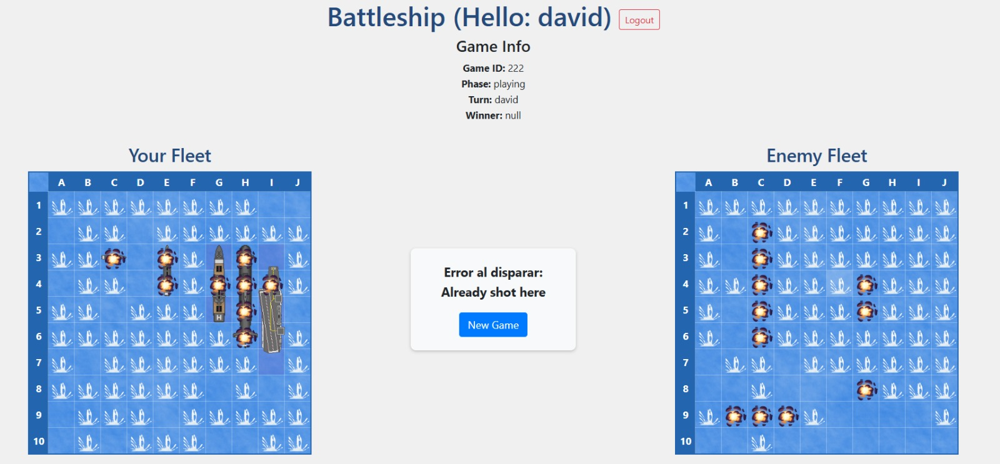

# About

> [!CAUTION]
> Afegiu la informació del grup, substituint G pel grup i XX per l'equip. 
> Afegiu el nom i cognoms dels membres de l'equip

| Equip | Membre 1           | Membre 2         |
|-------|--------------------|------------------|
| C01   | Madrid Leon, David | Rubio Poch, Eric | 

> [!CAUTION]
> Afegiu els vostres usuaris de github de la següent forma:
> ` { {#authors user1,user2} }`. Fixeu-vos en l'exemple d'aquesta pàgina.

{{#authors daaviidmadrid,rubio9669}}

> [!CAUTION]
> Afegiu les pàgines que considereu oportunes. Cal que aquest document contingui tota la informació de la pràctica.
> **Com a mínim:**
> - Llistat d'objectius complerts i no complerts
> - Resum de l'organització de l'equip de treball durant la pràctica
> - Descripció de les dificultats trobades durant la pràctica
> - Proves unitàries realitzades
> - Proves creuades realitzades
> - Captures on es vegi el funcionament final de la pràctica
> - Informació de desplegament de la pràctica

Llistat d’objectius complerts i no complerts
========================================================
Al llarg de la pràctica hem implementat amb èxit tots els objectius essencials relacionats amb la mecànica bàsica del joc. El sistema d’autenticació mitjançant JSON Web Tokens (JWT) funciona correctament, permetent controlar l’accés dels jugadors de manera segura. A més, entre les funcionalitats opcionals, hem implementat també el registre d’usuaris, facilitant la creació de comptes nous des del frontend i integrant-lo amb el sistema d’autenticació.

En relació amb la jugabilitat, el joc permet als jugadors col·locar els seus vaixells en el tauler, fer dispars contra el tauler enemic i rebre retroalimentació immediata sobre si han fet impacte o no. El sistema també detecta correctament quan un jugador ha enfonsat tota la flota del rival, tancant la partida i declarant automàticament el guanyador. Aquestes funcionalitats cobreixen plenament els requeriments bàsics del joc.

En l’àmbit del rendiment, comprovem que el sistema és capaç de gestionar múltiples partides i diversos jugadors de forma simultània, mantenint la coherència dels estats i evitant interferències entre sessions. Tanmateix, algunes funcionalitats opcionals no s’han implementat, com el mode multijugador en temps real, la possibilitat de reprendre partides desconnectades i el rànquing (leaderboard) post-partida.

No hem afegit cap funcionalitat extra més enllà de les especificades a l’enunciat, però considerem que la implementació actual compleix plenament amb els requisits essencials de la pràctica i presenta una estructura sòlida i escalable.

Organització de l’equip durant la pràctica
========================================================
Ens hem organitzat de manera bastant flexible i pràctica. La major part del temps hem treballat plegats, sovint des del mateix ordinador, repartint-nos les tasques sobre la marxa segons el que calia fer. Si una part ens costava més, ens hi posàvem junts fins que sortia. Això ens ha permès avançar de forma ràpida i detectar errors amb més facilitat, ja que ho podíem comentar en directe i provar al moment.

Quan no hem pogut estar físicament junts, hem treballat des de Discord, mantenint la coordinació i seguint amb les tasques que teníem pendents. No hem tingut una divisió molt marcada de rols, però cap al final del projecte, David ha dedicat moltes més hores, centrant-se sobretot en acabar de tancar el backend, corregir detalls i assegurar-se que tot funcionés de manera estable i completa.

En general, ens hem entès bé i hem anat resolent els problemes a mesura que han anat sortint, amb una col·laboració molt directa i constant.

Dificultats trobades durant la pràctica
========================================================
Una de les dificultats principals amb què ens hem trobat és que, en les primeres versions del projecte, totes les funcionalitats del joc estaven resoltes exclusivament al frontend. Això volia dir que era el navegador el que gestionava tota la lògica del joc: col·locava els vaixells al tauler, decidia si un tret era encertat o no, i fins i tot actualitzava l’estat del joc sense consultar el servidor. Tot i que això permetia una primera visualització funcional del joc, generava una arquitectura fràgil, sense persistència real ni control centralitzat, cosa que complicava afegir característiques com la validació de torns, la gestió de partides múltiples o la detecció del guanyador.

Quan vam decidir traslladar tota la lògica cap al backend, vam haver de reestructurar profundament el projecte. Això va implicar redissenyar els models de Django per representar les entitats del joc (jugadors, taulers, vaixells, trets), així com crear una API REST que permetés realitzar totes les accions de manera segura. Vam trobar problemes especialment a l’hora d’implementar la col·locació de vaixells, ja que havíem de transformar les dades enviades pel frontend en coordenades reals, distingir si eren en vertical o horitzontal, i garantir que no es sobreposessin ni sortissin dels límits del tauler. Aquest procés ens va obligar a treballar de manera precisa amb la informació del model BoardVessel i gestionar correctament la relació entre les coordenades inicials i finals.

Pel que fa a la gestió dels torns, com que no hem implementat el multijugador, vam optar per considerar que sempre és el torn del jugador humà. Aquesta simplificació ha estat útil, però ha requerit ajustar missatges d'estat i controlar que, malgrat la presència del bot, la informació mostrada fos sempre coherent amb aquest enfocament. En aquest sentit, vam tenir problemes per mantenir sincronitzat l’estat del joc entre accions consecutives, i vam optar per implementar un refresc automàtic del frontend cada 5 segons per garantir que es veiessin els canvis del backend en temps real.

Una altra dificultat tècnica important ha estat la serialització d’estructures complexes. El GameStateSerializer havia d’agrupar informació molt diversa (jugadors, taulers, posició dels vaixells, trets, etc.) i retornar-la en un format específic que el frontend pogués processar directament. Això ens va obligar a crear diversos SerializerMethodField, tractar manualment les dades, i garantir que l’ordre i l’estructura del JSON coincidís exactament amb l’expectativa del frontend. També vam haver de garantir que el jugador bot s’identifiqués sempre com player2, independentment de l’ordre d’inserció a la base de dades, cosa que vam resoldre filtrant explícitament per username.

Finalment, una dificultat pràctica que ens ha portat maldecaps ha estat garantir la presència del bot. Tot i crear-lo automàticament al backend si no existia, vam detectar que en alguns entorns o ordinadors el bot no es creava correctament, provocant errors de partida. Per resoldre-ho, vam assegurar-nos que en cada nova partida es comprovés explícitament si el bot existeix, i en cas contrari, es crea el User i el Player associats. A més, hem afegit tractaments de seguretat addicionals per garantir que cap partida es creï sense l’oponent virtual.

En conjunt, aquests reptes ens han fet aprofundir en la gestió d'estat compartit entre backend i frontend, en la modularització de la lògica del joc i en l'estructuració d'una API REST que sigui robusta, reutilitzable i fàcil d'entendre. Això ens ha aportat una visió molt més clara de com construir aplicacions web completes on el backend no només emmagatzema dades, sinó que juga un paper fonamental en el comportament i la seguretat del sistema.

Proves unitàries realitzades
========================================================
Hem fet moltes proves manuals durant tot el desenvolupament, validant cada funcionalitat a mesura que l’anàvem implementant, tant a nivell visual com intern. Les proves les hem realitzat des del frontend, connectat directament a l’API del backend, jugant com si fóssim usuaris reals.

Per començar, hem provat detalladament la col·locació de vaixells. Després d’enviar una petició per col·locar-los, consultàvem l’objecte game, especialment dins de boards, per confirmar que els vaixells s’havien afegit correctament, amb les coordenades, mida i orientació esperades. També hem comprovat que no es poguessin col·locar vaixells sobreposats o fora dels límits del tauler, i que el sistema retornés els errors corresponents.

Amb els dispars, hem validat que el backend detectava correctament si es tractava d’un hit o un miss, i ho comprovàvem mirant el tauler del bot. També hem intentat disparar més d’una vegada a la mateixa casella per assegurar-nos que el sistema ho bloquejava adequadament.

Hem jugat partides senceres per veure com evolucionava l’estat del joc pas a pas. Quan una flota quedava enfonsada, observàvem que l’estat canviava a gameover i que es registrava correctament el winner. També hem comprovat que els vaixells desapareixien del tauler quan quedaven destruïts i que les caselles afectades quedaven marcades de manera coherent.

A més, hem fet proves amb diversos usuaris per verificar que cada jugador només tenia accés a les seves pròpies dades i partides. Obríem sessions separades en diferents pestanyes i comprovàvem que no hi hagués filtracions d’informació entre partides.

També hem intentat accedir a parts del sistema sense estar autenticats, per veure si es denegava l’accés de manera segura. Igualment, hem enviat peticions incorrectes expressament, com coordenades negatives o dispars abans de col·locar vaixells, per veure si el servidor les rebutjava amb missatges d’error clars.

Finalment, totes les proves les hem anat fent sempre des del frontend, jugant com ho faria un usuari real. A través de la interfície, hem pogut validar que cada acció tingués l’efecte correcte i que la informació es mostrés i s’actualitzés com tocava. Això ens ha permès detectar detalls com si els vaixells es representaven malament, si l’estat no canviava com esperàvem després d’un tir, o si alguna acció no donava cap resposta visual. Aquest procés ha estat constant durant tot el desenvolupament i ens ha servit per entendre el comportament global del sistema i anar ajustant el funcionament perquè tot quedés ben lligat.

Explicació del codi
========================================================

El nostre codi es basa en una arquitectura client-servidor, on el backend està desenvolupat amb Django i Django REST Framework, i el frontend amb Vue.js. Al backend, el model central és el de Game, que representa una partida. Aquest es relaciona amb els models Player, Board, Vessel i Shot, que permeten modelar l’estat complet del joc. Cada jugador té un tauler (Board) i hi pot tenir diversos vaixells (BoardVessel), mentre que els trets queden enregistrats amb instàncies del model Shot.

Un dels punts més rellevants és l’ús de serialitzadors imbricats per poder construir una resposta JSON complexa amb tota la informació d’una partida. Utilitzem un GameSerializer que conté dins seu un GameStateResponseSerializer, el qual encapsula el GameStateSerializer, amb camps personalitzats com player1, player2, turn, winner, etc. Aquests camps no es poden obtenir automàticament i per això hem fet ús de SerializerMethodField i mètodes personalitzats que accedeixen a l’usuari que fa la petició per determinar, per exemple, qui és el jugador actual i qui és l’oponent. També hem afegit tractaments específics perquè el jugador bot sempre sigui identificat com player2.

Per tal de gestionar correctament els torns i el guanyador, implementem tota la lògica al backend: quan es fa un tret, es comprova si impacta, s’actualitza l’estat del vaixell, i si és necessari es declara el guanyador. Aquesta informació es reflecteix automàticament a la resposta del getGameState. En cas d’una partida d’un sol jugador, el bot respon de forma immediata després del tir del jugador, cosa que s’ha resolt directament dins de la funció de dispar per garantir un flux fluït. A més, s’ha optat per mantenir sempre el torn a nom del jugador per evitar inconsistències de sincronització, i el frontend s’actualitza automàticament cada 5 segons per mantenir la partida sincronitzada.

Un altre aspecte important és la col·locació dels vaixells. Quan el jugador selecciona un vaixell i una posició, el frontend envia una petició POST al backend, que registra la posició al model BoardVessel i marca el vaixell com preparat. Quan tots els vaixells estan col·locats, el sistema passa automàticament a la fase de joc. També s’ha implementat una lògica per fer que el bot col·loqui els seus vaixells automàticament, i es controla des del backend que això només passi una vegada per partida.

Pel que fa al frontend, el Game.vue actua com a controlador principal de la partida. Mostra els taulers, permet fer clic per col·locar vaixells i disparar, i inclou una zona d’informació amb el torn, la fase i el guanyador. A més, mostra de forma ordenada el gameState complet amb un pre que permet depurar en temps real. Per evitar errors visuals o incoherències, es controla que les accions només estiguin actives en la fase corresponent, i s’ofereixen missatges d’error clars quan una acció no es pot fer (com intentar col·locar un vaixell en una casella ocupada o disparar dues vegades al mateix lloc).

Finalment, cal destacar que hem inclòs tractaments de casos especials, com la creació automàtica del bot si no existeix, la rotació dels vaixells, la gestió de partides des del punt de vista d’un usuari autenticat, i la validació contínua de l’estat del joc. Tota aquesta estructura permet tenir una base sòlida, extensible i fiable sobre la qual es poden implementar fàcilment noves funcionalitats com el multijugador real, estadístiques o el rànquing.

Captures de pantalla
========================================================

Pantalla d'inici

Pantalla de registre

Pantalla al accedir (token + jugadors)

Pantalla estat inicial del joc

Pantalla informació debug de estat inicial del joc

Pantalla de joc en marxa

Pantalla de error al disparar a una casella ocupada

Patalla de joc finalitzat

